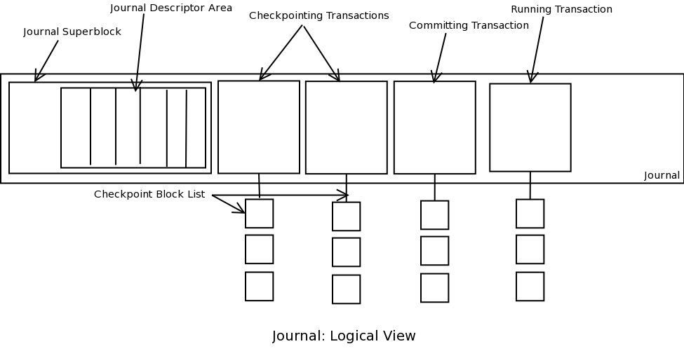

hu泽杰写的globalcache系统的日志代码部分
# Checkpoint做的事
# Recovery做的事
## 1. 从尾到头遍历日志
要应用的日志一定是从已写日志的末尾j_tail开始的，这个j_tail是以块为单位的，是建立在obj_store上层的块存储抽象。从j_tail得到j_oid_idx和off，也即其在底层对象存储中的地址。
### 1.1 读journal_header
journal_header的写对象存储应该是有保证不跨块的，从j_oid, off处指定读的长度读出到JournalHeaderl类型的journal_header
```C++
objstore->ObjRead(j_oid, (char*)&journal_header, sizeof(JournalHeader), off);
```
### 1.2 读各个描述块对象并应用日志
先根据jouenal_header.desc_num读出所有存储描述块的块。

然后遍历各个描述块得到desc_info，将脏页读出来并写到home location（desc_info里面包含这些信息）。

写完之后改下journal的超级块：jsb->j_tail和jsb->j_free的改动持久化。

### 1.3 如果应用了完了日志，journal超级块重置
重置超级块，并释放desc_buf和write_buf
```C++
if (need_update) {
    jsb->j_tail = 0;
    jsb->j_head = 0;
    jsb->j_free = JOURNAL_BLOCK_MAX_NUM;
    FlushJSB();
    if (desc_buf != nullptr) free(desc_buf);
    if (write_buf != nullptr) free(write_buf);
}
```

todo: 其实还可以整理下几个条件变量和函数之间的依赖关系

Linux: the Journaling Block Device

https://web.archive.org/web/20070926223043/http://kerneltrap.org/node/6741

https://zhuanlan.zhihu.com/p/194130018

实现概要

Commit

[journal_commit_transaction(journal object)]

Kjournald线程与每个进行日志的设备相关联。Kjournald线程保证运行中的事务会在一个特定的时间间隔后被提交。事务提交的代码分成了如下八个不同的阶段。图1给出了日志的逻辑结构。

阶段0：将事务的状态从运行（T_RUNNING）变为锁定（T_LOCKED），这样，这个事务就不能再添加新的handle了。事务会等待所有的handle都完成的。当事务初始化的时候，会预留一部分缓冲区。在这一阶段，有些缓冲区可能没有使用，就被释放了。在这里，所有事务都完成了之后，事务就已经准备好了可以被提交了。
代码上，首先committing tx获得running tx, running tx清空，然后在互斥量tx_mutex上等一个commit_tx的ref_cond条件变量, 把事务状态从WAITTING_COMMIT(LOCKED)变为COMMITTING
```cpp
GCFSErr Journal::CommitUnlock(bool force) {
    ...
    pthread_mutex_lock(&this->journal_tx_mutex);
    ...
    assert(this->commit_tx == nullptr);
    this->coimmit_tx = this->running_tx;
    this->running_tx = nullptr;
    if (commit_tx->ref_count > 0) {
        LOG(INFO) << "Commit wait ...";
        this->commit_tx->tx_state = TX_WAITTING_COMMIT;
        pthread_cond_wait(&this->commit_tx->ref_cond, &this->journal_tx_mutex);
        this->commit_tx->tx_state = TX_COMMITTING;
        pthread_cond_broadcast(&this->commit_state_cond);
        LOG(INFO) << "Commit wait done";
    }
    this->commit_tx->tx_state = TX_COMMITTING;
}
```
等待的tx->ref_cond由StopTx唤醒，也即当tx要停止时，ref_count--（StartTx时ref_count++）
阶段1：事务进入到写入状态（T_FLUSH）。事务被标记为正在向日志提交。这一阶段中，也会标记该日志中没有运行状态的事务存在；这样，新的handles请求将会导致新的事务初始化。
```cpp
Transaction* Journal::StartTx() {
    pthread_mutex_lock(&this->journal_tx_mutex);
    if (this->commit_tx != nullptr && this->commit_tx->tx_state == TX_WAITTING_COMMIT) {
        pthread_cond_wait(&this->commit_state_cond, &this->journal_tx_mutex);
    }

    if (this->running_tx == nullptr) {
        this->running_tx = new Transaction();
        this->running_tx->tx_state = TX_RUNNING;
    }
    this->running_tx->ref_count++;
    Transaction* tx = this->running_tx;
    pthread_mutex_unlock(&this->journal_tx_mutex);
    return tx;
}
```
Journal::commit_state_cond由Journal::CommitUnlock(bool force)唤醒，也即Journal::commit_tx->ref_cond为0, (commit)tx状态由TX_WAITTING_COMMIT变为TX_COMMITTING后, 新的running_tx可以继续（应该是commit_tx由WAITTING_COMMIT变为TX_COMMITTING时，没有非空running存在？）